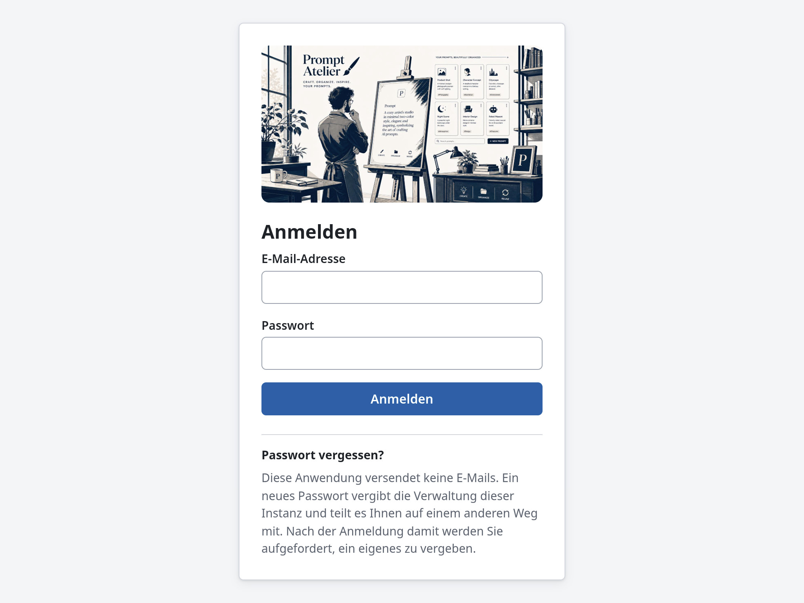
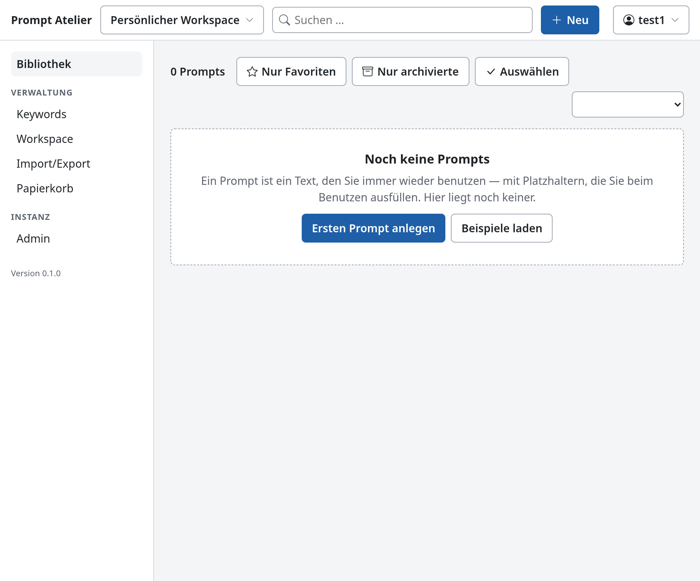
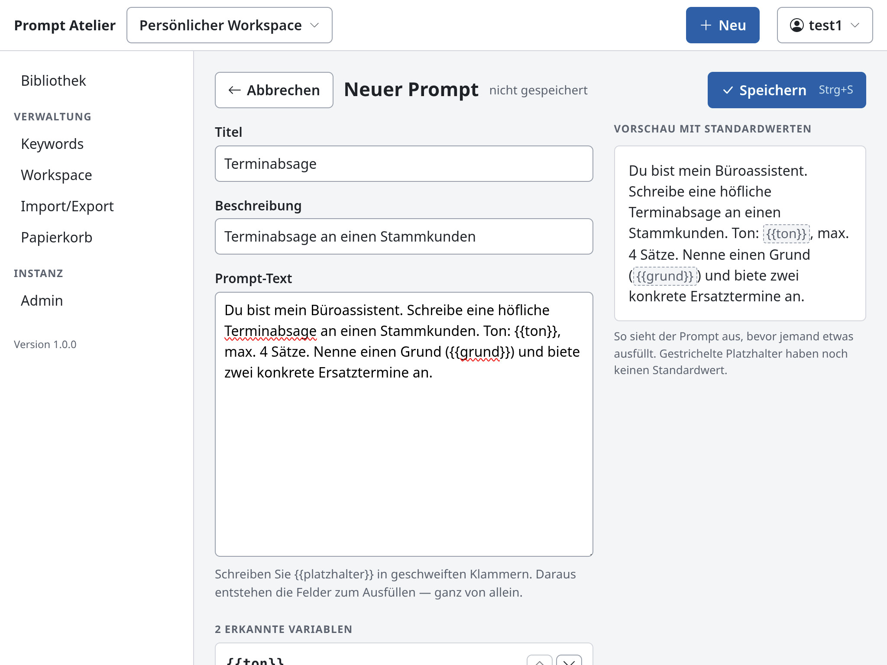
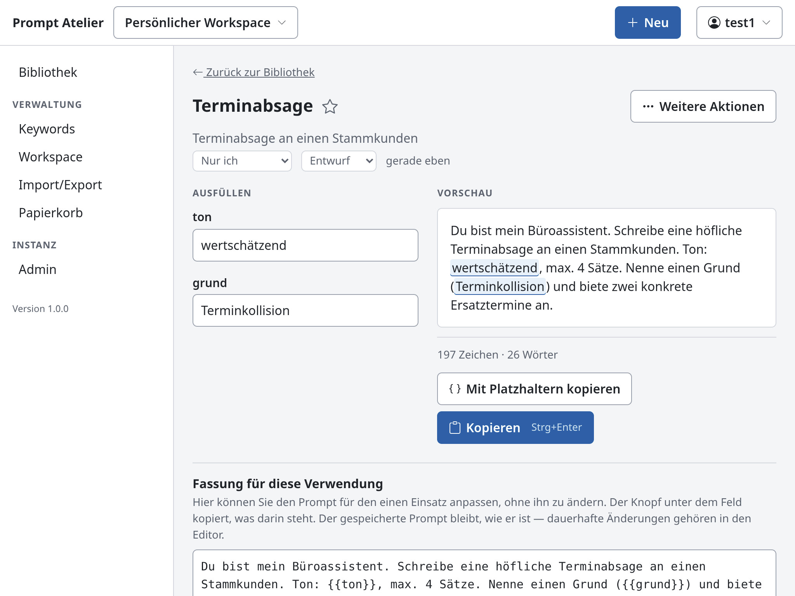
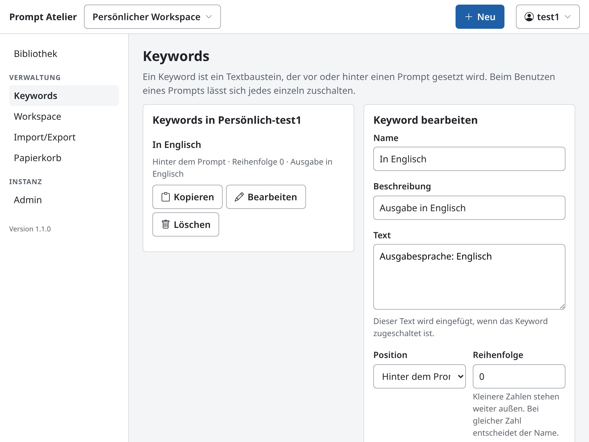
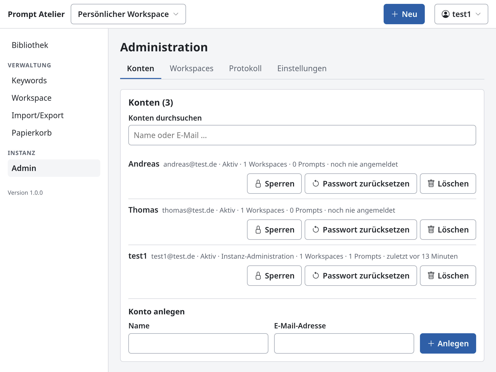

**English** · [Deutsch](README.de.md)

# Prompt Atelier

Self-hosted web application for managing and reusing AI prompts.

Prompts accumulate scattered across notes, chat histories and text files. Prompt Atelier collects them in one place, turns the parts that change into variables, and hands you the finished text ready to copy.

```
find a prompt  →  fill in the fields  →  check the preview  →  copy
```

---

## Features

| Area | Description |
|---|---|
| Library | Full-text search across title, description, body and tags. Spelling variants are resolved: `Größe` is found by typing `groesse` or `grosse` |
| Variables | Placeholders in double curly braces become form fields with a default value, a required flag and a list of options. Unicode letters are permitted |
| Live preview | The finished text is assembled as you type. Browser and server produce the same result |
| Keywords | Reusable blocks of text placed before or after a prompt |
| Workspaces | Personal, shared and instance-wide areas with the roles `viewer`, `editor`, `admin` and `owner` |
| Change history | Trash with 30 days of retention, undo of the last change, revisions per prompt |
| Import and export | JSON and Markdown, lossless in both directions |
| Interface languages | German, English, French, Italian, Spanish |

The application requires a sign-in, sends no email and calls no external service at runtime.

---

## Screenshots

| | |
|---|---|
| |  |
|  |   |
|  |  |


---

## Requirements

| Environment | Requirement |
|---|---|
| Linux | Ruby 3.3 or newer, with development headers and a compiler |
| Windows | Ruby 3.3 or newer, installed as RubyInstaller with DevKit |
| Both | Bundler, 500 MB of disk space, 1 GB of memory, one free TCP port |

Node.js is not needed to run the application. The interface ships already built.

Debian 12 provides Ruby 3.1 and does not meet the requirement. Debian 13 provides Ruby 3.3, but `ruby-full` brings no Bundler. On Debian and Ubuntu:

```bash
sudo apt install -y ruby-full ruby-dev build-essential curl
sudo gem install bundler -v 4.0.11
```

The application is designed for instances of up to 50 users and 20,000 prompts.

---

## Installation

Download the archive from the [releases page](../../releases). One platform-independent archive is published, and it runs on every supported system.

```bash
tar -xzf promptatelier-1.0.1-universal.tar.gz
cd promptatelier-1.0.1-universal
scripts/install.sh
```

On Windows, unpack the ZIP archive and run `scripts\install.bat`.

The installer checks the requirements, creates the configuration, the database and the first user account, sets up the chosen operating mode, and finally starts the instance to verify it answers. The address is printed at the end. With the default values unchanged it is <http://127.0.0.1:9292>.

### Starting

```bash
scripts/start_portable.sh      # in the foreground, Ctrl+C stops the application
scripts/service_install.sh     # as a system service with automatic start
```

### First steps

1. Open the address in a browser and sign in with the account created during installation.
2. Optionally load sample content: `scripts/seed_demo.sh`. Calling it with `--remove` takes it back out.
3. Open a prompt, fill in the fields and copy the text.

### Backups

```bash
scripts/backup.sh              # creates a backup while the application runs
scripts/restore.sh <file>      # restores a backup
```

> **Warning:** Do not copy the database file by hand. In WAL mode part of the data lives in side files. A manual copy is incomplete without any integrity check reporting it.

---

## Documentation

| Document | Contents |
|---|---|
| [Installation and operation](doc/installation.md) | The complete path from requirements to a running instance, for both operating systems and all operating modes |
| [Operations manual](doc/operations.md) | Reference for day-to-day operation, including every script and every configuration key |
| [Developer manual](doc/development.md) | Layout of the source, development environment, design decisions |

German versions are available beside each file, named `*.de.md`.

| Project file | Purpose |
|---|---|
| [CHANGELOG.md](CHANGELOG.md) | What changed in each release |
| [CONTRIBUTING.md](CONTRIBUTING.md) | How to propose a change |
| [SECURITY.md](SECURITY.md) | How to report a vulnerability |

---

## Technical outline

Ruby 3.3 with Sinatra 4 as a JSON interface, Vue 3 as a single-page application, SQLite with FTS5 full-text search and Puma as the application server. One process, one database file, no external runtime dependencies.

The application is not intended as a chat client, a model playground or a wiki. Sending prompts directly to a language model is planned for a later release.

---

## License

[MIT](LICENSE.md), Copyright (c) 2026 formic.

The bundled libraries are licensed under MIT, ISC, Apache-2.0 or BlueOak. The platform-specific archive contains the Ruby libraries together with their license texts.
